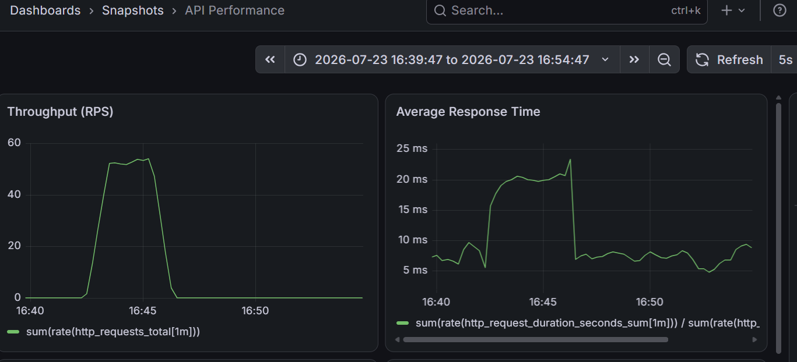
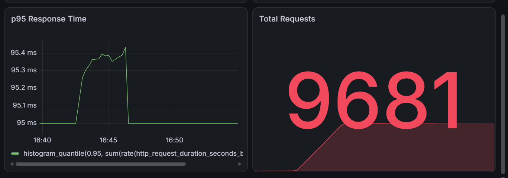
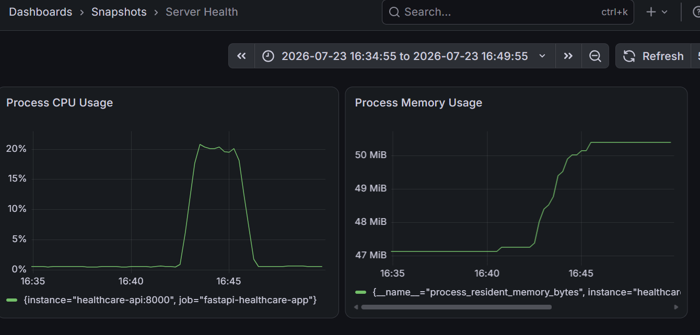
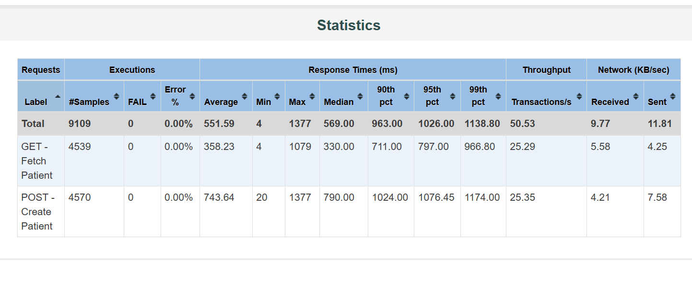

# 🏥 Healthcare EHR API Performance Engineering & Observability Pipeline

An end-to-end Performance Engineering project built around a Healthcare
Electronic Health Record (EHR) REST API. The project demonstrates API
development, performance testing, observability, monitoring, and
containerization using an industry-standard toolchain.

------------------------------------------------------------------------

# 🚀 Features

-   FastAPI-based Healthcare EHR REST API
-   Docker & Docker Compose deployment
-   Apache JMeter load testing
-   Prometheus metrics collection
-   Grafana dashboards
-   Pytest smoke testing
-   HTML Performance Reports
-   Real-time CPU & Memory monitoring

------------------------------------------------------------------------

# 🏗️ Architecture

``` text
                JMeter
                   │
        Load Generation (50 Users)
                   │
                   ▼
         FastAPI + Uvicorn (Docker)
                   │
     Prometheus Instrumentator
                   │
          /metrics Endpoint
                   │
             Prometheus
                   │
             Grafana Dashboards
```

------------------------------------------------------------------------

# 📁 Project Structure

``` text
Healthcare-api-performance-testing/
├── docs/
│   ├── api_throughput_response_time.png
│   ├── api_p95_total_requests.png
│   ├── server_health_dashboard.png
│   └── jmeter_statistics_report.png
├── jmeter/
    ├── Report/          
│   ├── Healthcare_Load_Test.jmx         
│   └── results.jtl                      
├── monitoring/
    ├── Grafana/                         
│   └── prometheus.yml 
├── tests/
    └── test_smoke.py 
├── docker-compose.yml
├── Dockerfile
├── main.py
├── requirements.txt
└── README.md
```

------------------------------------------------------------------------

# 🛠️ Tech Stack

  Category              Technology
  --------------------- ------------------------
  API                   FastAPI, Uvicorn
  Performance Testing   Apache JMeter
  Monitoring            Prometheus
  Dashboards            Grafana
  Containerization      Docker, Docker Compose
  Testing               Pytest

------------------------------------------------------------------------

# ⚙️ Performance Test Configuration

  Parameter        Value
  ---------------- -----------------
  Virtual Users   - 50

  Ramp-up Period  - 30 Seconds

  Test Duration   - 180 Seconds

  Loop Count     -  Infinite

  Workload       -  GET & POST APIs

------------------------------------------------------------------------

# 📊 Performance Summary

  Metric                      Result
  --------------------------- ---------------------
  Total Requests              9,681

  Peak Throughput             \~50.5 Requests/sec

  Average API Response Time   \~22 ms

  P95 Response Time           \~95 ms

  Peak CPU Usage              \~20%

  Peak Memory Usage           \~50 MiB

  Error Rate                  0%

### Key Observations

-   Sustained approximately **50 Requests/sec** without throughput degradation.
-   **95% of requests completed within 95 ms**.
-   CPU utilization remained below **20%**, indicating available capacity.
-   Memory increased from **47 MiB** to **50 MiB** and stabilized.
-   No HTTP failures or dropped requests were observed.

------------------------------------------------------------------------

# 📷 Dashboard Screenshots

## API Performance Overview



------------------------------------------------------------------------

## P95 Response Time & Total Requests



------------------------------------------------------------------------

## Server Health Dashboard



------------------------------------------------------------------------

## JMeter HTML Report



------------------------------------------------------------------------

# ▶️ Running the Project

## Build & Start

``` bash
docker-compose up --build -d
```

## Smoke Test

``` bash
pytest tests/test_smoke.py
```

## Execute Load Test

``` bash
cd jmeter
jmeter -n -t Healthcare_Load_Test.jmx -l results.jtl
```

## Generate HTML Report

``` bash
jmeter -g results.jtl -o Report
```

------------------------------------------------------------------------

# 🌐 Access Services

  Service           URL
  ----------------- ----------------------------
  FastAPI Swagger   http://localhost:8000/docs

  Prometheus        http://localhost:9090

  Grafana           http://localhost:3000

Default Grafana Credentials

-   Username: admin
-   Password: admin

------------------------------------------------------------------------

# 💡 Future Improvements

-   PostgreSQL backend
-   Locust stress testing
-   GitHub Actions CI
-   Kubernetes deployment
-   Node Exporter
-   Alertmanager notifications

------------------------------------------------------------------------

# 📌 Skills Demonstrated

-   Performance Engineering
-   API Performance Testing
-   Observability
-   FastAPI Development
-   Docker
-   Prometheus
-   Grafana
-   Apache JMeter
-   Pytest
-   REST API Testing
